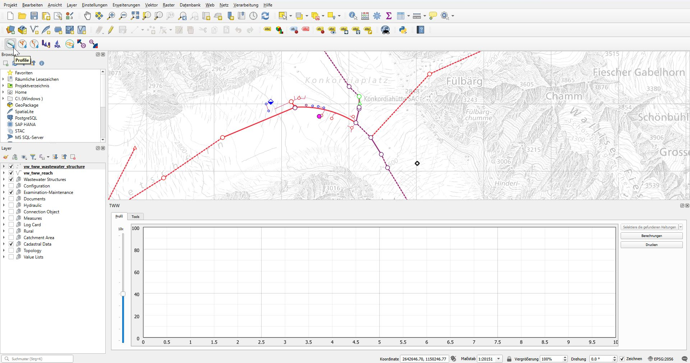
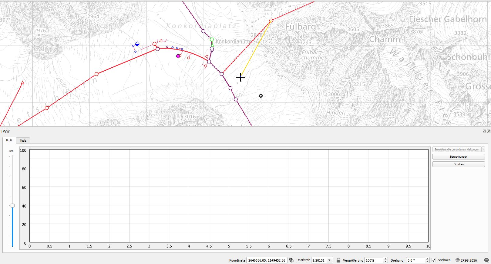
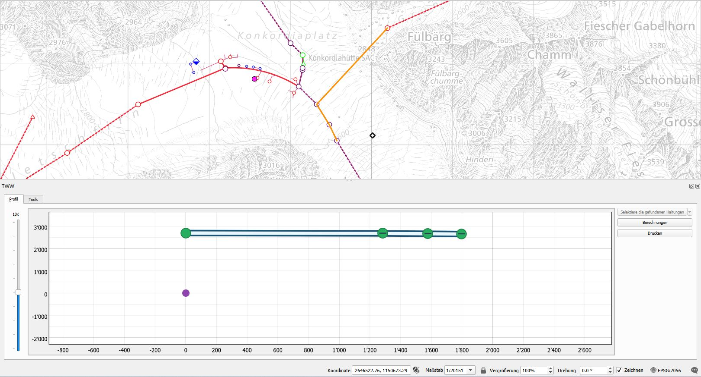

Length profiles
===============

This represents a guide on how to choose a section and display a length profile.

General
-------

TWW has a unique function to display length profiles. 

The following elements are displayed:

Wastewater_Structures such as Manholes, Special_structures etc. with
Cover
Bottom_Level

Reaches with 
From and to Reach_point

TO DO: Add some screenshots to show details

If a level is missing it is indicated with xxxx (add description of icon)

Length profile selection
------------------------

Choose the length profile button to start.

.. figure:: images/profile_button_selected.jpg

The length profile window opens.

Select the **vw_tww_wastewater_structure** layer to select a starting point.

Then select a next manhole - it is not needed to be the direct next one. The tool automatically selects the manholes in between.
You can repeat this several times. If there is no continuity you will get a warning. Right click to finish your selection.

In the profile window you now have the length profile. You can see detail info about manholes.

NOT YET IMPLEMENTED: see https://github.com/sjib/teksi_wastewater_dev/issues/1#issuecomment-3889867186
If you hover over a manhole in the profile window you can see that the canvas correspondent gets highlighted in green.

.. figure:: images/profile_connected_manhole.jpg

Same goes for the reaches.

.. figure:: images/profile_connected_reach.jpg

Length profile interpretation
-----------------------------

Then length profile indicates you very quickly if there are missing levels (NULL values) and helps you to see if you added the levels correctly.

xxx Add detailed description how icons are set (to decide later if moved to another part of documentation (developers guide) or not. Start with general hints and then details.

Printing
---------
NOT YET IMPLEMENTED
Select the **Print** button to send the profile to your selected printer. If you have installed a pdf printer you can save it as a pdf file.
